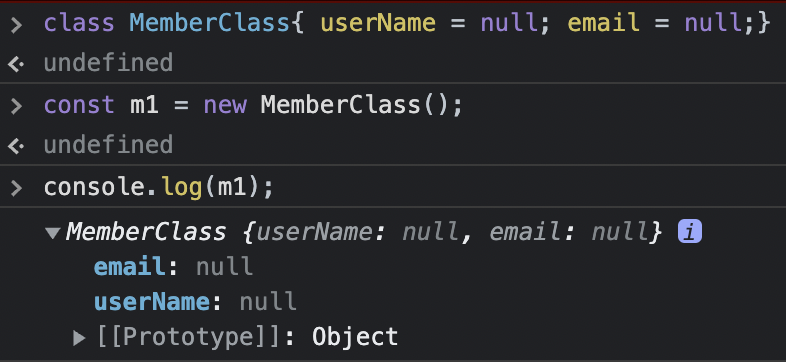

프로그래밍 언어의 종류에는 객체지향 언어와 절차지향 언어가 있다.  
그 중 객체지향 언어는 클래스 기반 객체지향과 프로토타입 기반 객체지향으로 구분된다.  
ES5까지의 Javascript는 프로토타입 기반 객체지향 언어에 해당한다.  
- 객체의 의미  
하나의 변수 안에 비슷한 특성을 갖는 변수와 함수가 내장된 형태.  
객체 안에 내장된 변수를 `맴버변수` 혹은 `프로퍼티(속성)(property)`라고 한다.  
객체 안에 내장된 함수를 `메서드`라고 한다.  
- 생성자 함수  
함수를 `new`연산자를 사용하여 호출하는 경우 이 함수는 Javascript에 의해 객체를 만들기 위한 함수로 분류된다.  

```js
생성자함수.prototype.메서드이름 = function(파라미터1,파라미터2, ...파라미터n){
    ...
    return 돌려줄_값;
}
// 메서드 호출
const 객체이름 = new 생성자함수();
const k = 객체이름.메서드이름();

```
   
```js
function helloworld(){

}
const h = new helloworld();
```
위와 같이 사용되는 함수를 `생성자(Constructor)`라고 한다.  
생성자를 호출하며 리턴을 변수는 생성자 함수 자체의 리턴 유무에 상관 없이 객체가 된다.  
화살표 함수 형식은 생성자로 사용할 수 없다.
  
- 메서드
객체에 포함된 함수. 특정한 목적을 위한 함수가 다수 존재할 때, 이 함수들을 그룹화 해 놓은 형태를 객체로 볼 수 있다.  
  - `prototype 속성` : Javascript의 모든 객체는 prototype이라는 속성을 갖는다. 이 속성을 생성자 함수에 대해 활용하면 생성자 함수에 속한 다른 변수나 함수를 추가할 수 있다.(주로 함수 추가에 사용한다.) 즉, 먼저 정의된 생성자의 기능을 prototype을 통해 확장할 수 있다.  
  - `getter, setter` : 객체지향에서는 객체를 통한 맴버변수의 직접 접근이 맴버변수에 값을 대입하는 과정에서 그 값의 적절성을 판단할 수 없고, 무조건적으로 대입하기 때문에 코드 보안에 부적절하다고 본다. 맴버변수에 값을 간접적으로 대입하는 특수한 형태의 함수를 `setter`, 맴버변수의 값을 리턴받기 위해 사용하는 특수한 형태의 함수를 `getter`라고 한다.


## 생성자

<div class="primary--notice" markdown="1">

`맴버 변수를 갖는 생성자를 통해서 객체 만들기`

```js
function User(){
    //맴버변수 정의 (일반적으로 맴버변수는 일반 변수와 구분하기위해 (_)로 시작하는 이름을 갖는다.)
    this._id = null; 
    //생성자 함수 안에서 this 키워드를 통해 정의한 변수는 객체의 맴버변수 역할을 한다.
    this._email = null;
};
// 생성자를 통한 객체 만들기
const foo = new User();
foo._id = "hello";  // foo객체 this._id 에 "hello" 저장.
foo._email = "hi@naver.com";    //위와동일
```
  
`파라미터를 맴버변수에 복사하는 생성자`

```js
const User2 = function(id, email){
    this._id = id;
    this._email = email;
};

const foo = new User2("hello", "hi@naver.com");
console.log(foo); // User2 { _id: 'hello', _email: 'hi@naver.com' }
```

</div>

## 매서드
<div class="primary--notice" markdown="1">  

`prototype을 활용한 매서드 정의`

```js
const User3 = function(id, email){
    this._id = id;
    this._email = email;
};
//로그인 수행 매서드
User3.prototype.login = function(){
    // 객체안에 속한 메서드 안에서는 생성자가 정의한 맴버변수를 마음껏 활용할 수 있다.
    console.log(`로그인 되었습니다 -> id:${this._id}, email:${this._email}`);
}
//로그아웃을 수행하는 매서드
User3.prototype.logout = function(){
    // 객체안에 속한 메서드 안에서는 생성자가 정의한 맴버변수를 마음껏 활용할 수 있다.
    console.log(`로그아웃 되었습니다 -> id:${this._id}, email:${this._email}`);
}
const student = new User3(`학생`, `hi@naver.com`);
student.login();    //객체 안에 내장된 메서드 호출
student.logout();
```
</div>

## getter, setter
<div class="primary--notice" markdown="1">

`get, set활용`
- Object.defineProperty(생성자이름.prototype, 함수이름, {getter,setter 정의}) 형식으로 특정 맴버변수에 대한 getter,setter를 정의할 수 있다. getter,setter는 같은 함수이름을 공유한다.  


```js
function User4(){
    this._id = null;
    this._email = null;
}
Object.defineProperty(User4.prototype, `id`, {
    get: function(){
        console.log(`id에 대한 getter 호출됨`);
        return this._id;//맴버변수의 값을 반환하는 기능
    },
    set: function(param){
        console.log(`id에 대한 setter 호출됨`);
        this._id = param;//파라미터 값을 맴버변수에 복사하는 기능
    }
});

Object.defineProperty(User4.prototype, `email`, {
    get: function(){
        console.log(`email에 대한 getter 호출됨`);
        return this._email;//맴버변수의 값을 반환하는 기능
    },
    set: function(param){
        console.log(`email에 대한 setter 호출됨`);
        this._email = param;//파라미터 값을 맴버변수에 복사하는 기능
    }
});

const friend = new User4();
//함수이지만 변수처럼 사용한다.
friend.id = `친구`;
//setter를 호출한다. 대입되는 값은 setter에 전달되는 파라미터.
// const 변수 = 객체.함수이름; -> getter를 호출한다. 맴버변수를 대입하는 것 같지만 실제로는 getter를 호출해서 리턴값을 받는 과정이다.

friend.email = `hi@naver.com`;
console.log(friend.id);
console.log(friend.email);
// id에 대한 setter 호출됨
// email에 대한 setter 호출됨
// id에 대한 getter 호출됨
// 친구
// email에 대한 getter 호출됨
// hi@naver.com
```

</div>

## json 활용
`생성자이름.prototype = {...}`형식으로 getter, setter, 메서드 등을 한번에 추가할 수 있다.  
이러한 형식으로 생성자, 맴버변수, getter, setter, 메서드 등이 묶여 있는 단위를 `클래스`라 한다.  
클래스에 정의된 기능을 하나의 변수에 모두 부여한 형태가 `객체`이다.  

<div class="primary--notice" markdown="1">

`prototype을 활용한 매서드 정의`

```js
function Member(username, password){
    this._username = username;
    this._password = password;
}
//json을 활용하여 getter, setter와 메서드 추가하기.
Member.prototype = {
    get username(){
        return this._username;
    },
    set username(param){
        this._username = param;
    },
    get password(){
        return this._password;
    },
    set password(param){
        this._password = param;
    },
    login: function(){
        console.log(`로그인! username=${this.username}, password=${this.password}`);
        //this._username 를 쓰지않고 this.username을 쓰는 이유는 기존 변수를 지키기 위해서이기도 하다.
        //변수값은 get을 통해 전해져서 더 안전하다.
        //Get,set만드는이유는 맴버변수에 접근을막기위해사용한다.(오류발생여부 차단을위해 사용)
    },
    logout: function(){
        this.username = "";
        this.password = "";
        console.log(`로그아웃! username=${this.username}, password=${this.password}`);
        //값이 공백으로 나온다.
    }

};
console.log(Member.prototype);
// {
//   username: [Getter/Setter],
//   password: [Getter/Setter],
//   login: [Function: login],
//   logout: [Function: logout]
// }
const member1 = new Member(`hihi`, `1234`);// 정의된 클래스를 통해 객체 생성
console.log(member1.username);// hihi
console.log(member1.password);// 1234
member1.login();// 로그인! username=hihi, password=1234
member1.logout();// 로그아웃! username=, password=
member1.username = `world`; //setter를 통한 맴버변수 변경
```
좀 더 정확하게 구분하자면  
`const 객체`로 선언된 객체는 `객체 참조 변수`라고 부르고, `new 생성자이름()`부분에서 생성된 object를 인스턴스 라고 한다.
</div>

## Class
prototype이 발전된 형태로 ES6 버전에서 추가된 객체 설계 문법

### 객체(Object)
- 사전적 의미 : 어떠한 물건이나 대상
- 프로그래밍에서의 의미 : 프로그램에서 표현하고자 하는 기능을 묶기 위한 단위  
`객체를 구성하는 단위`
- 객체를 이루는 것은 데이터와 기능이다.
- 데이터는 변수로 표현된다.
- 객체 안에 포함된 변수를 맴버변수 혹은 프로퍼티(property)혹은 필드(field)라 한다.
- 기능은 메서드(=함수)로 표현된다.

### 클래스(Class)
객체의 설계도 역할을 하는 프로그램 소스.  
공장에서 하나의 설계도를 사용하여 여러 개의 제품을 생산할 수 있는 것처럼 하나의 클래스를 통해 동일한 구조를 갖는 객체를 여러 개 생성할 수 있다.  

`클래스의 가장 기본적인 코드 형식`  
클래스 이름은 명사들의 조합으로 이루어지며 첫 글자는 대문자로 지정하는 것이 관례이다.  
```js
class 클래스이름{
    //맴버변수 선언
    // 생성자 -> 맴버변수 초기화
    // getter, setter
    // 메서드
}
```
`클래스를 통한 객체 생성하기`  
`new` 예약어를 사용한다.  
```js
var|let|const 변수이름 = new 클래스이름();
```
일반적으로 JS에서의 객체 선언은 `const`키워드를 사용한다.  
위와 같이 정의하면 변수는 클래스 안에 정의된 모든 기능을 부여받은 특수한 형태의 변수가 되는데 이를 객체라고 하고, 객체는 자신에게 부여된 기능을 점(.)을 통해 접근할 수 있다.  

```js
객체.맴버변수 = 값;
객체.메서드();
```
`클래스의 작성 패턴`  
- 변수만 정의
- 메서드만 정의
- 변수와 메서드를 함께 정의  
객체라는 개념은 배열이 같은 종류의 변수들만 그룹화 하는 한계를 벗어나 서로 다른 종류의 변수를 그룹화 하는데서 출발한다.(이 상태를 c언어의 구조체라고 한다.)  
그렇게 그룹화 해 놓은 변수들간의 관계를 구현하기 위해 메서드를 함께 포함하는 형태로 발전된 것이다.  
`변수만 정의한 클래스`
```js
class 클래스이름{
    변수1 = 값;
    변수2 = 값;
    ...
    변수n = 값;
}
```
변수에 값을 초기화 하지 않더라도 맴버변수는 생성된다.  
이 경우 객체를 생성하면 맴버변수는 모두 undefined 상태로 존재하기 때문에 객체를 통해 값의 초기화를 별도로 수행해야 한다.
  
`JSON 형식의 객체와 차이`  
class 나 prototype을 통해 new로 생성된 객체는 구조는 동일하지만 각각 독립적인 값을 갖는다.  
JSON으로 생성되는 객체는 싱글톤으로서 존재하므로 단순 복사만으로는 동일한 형식을 갖는 두 개의 데이터를 생성할 수 없다. 서로 독립적인 데이터를 보유하려면 동일한 JSON 코드를 한 번 더 작성해야 하거나 깊은 복사를 수행하기 위한 재귀호출 코드를 직접 작성해야 한다.
  
`메서드만 정의한 클래스`  
용도나 목적이 같은 메서드들을 별도의 클래스로 묶어둔다.
```js
class 클래스이름{
    함수이름1(...){...}
    함수이름2(...){...}
    ...
    함수이름n(...){...}
}
```
`메서드와 맴버변수를 함께 갖는 클래스`  
맴버변수의 스코프는 클래스 내의 모든 메서드에서 식별 가능하다. 결국 맴버변수는 모든 메서드가 공유하는 전역 변수의 개념이 된다.  
같은 클래스에 속한 맴버변수나 함수끼리는 예약어 `this`를 통해서만 접근 가능하다.  
```js
class 클래스 이름{
    변수1 = 값;
    변수2 = 값;
    ...
    변수n = 값;

    함수이름1(...){...}
    함수이름2(...){...}
    ...
    함수이름n(...){...}
}
```
`생성자 함수`  
`new`예약어를 사용하여 인스턴스가 생성될 때 자동으로 실행되는 특수한 함수로서 주로 맴버변수의 값을 초기화 하기 위해 사용한다.  
함수 이름이 `constructor()`로 예약되어 있다.  
필요에 따라 파라미터를 정의할 수 있으며 파라미터는 주로 맴버변수와 1:1로 대응된다.  
클래스 레벨에서 맴버변수를 초기화 할 경우 객체를 생성하면서 맴버변수의 값을 변경할 수 없지만 생성자를 사용하면 객체 생성 단계에서 맴버변수의 값을 다양하게 변경할 수 있다.  

```js
class 클래스이름{
    변수1;
    변수2;
    ...
    변수n;
    constructor(파라미터1,파라미터2,..., 파라미터n){
        this.변수1 = 파라미터1;
        this.변수2 = 파라미터2;
        ...
        this.변수n = 파라미터n;
    }
}
```
<div markdown="1" class="primary--notice">

`생성자예시`

```js
class MyClass {
    name;
    speed;
    dps;
    constructor(name, speed, dps){
        this.name = name;
        this.speed = speed;
        this.dps = dps;
        console.log(`생성자를 통한${this.name} 객체 초기화 완료! (speed=${this.speed}, dps=${this.dps})`);
    }
    move(where){
        console.log(`${this.name}가 ${where}FH ${this.speed}의 속력으로 이동합니다.`);
    }
    attack(target){
        console.log(`${this.name}가 ${target}에게 초당 ${this.dps}의 데미지를 입힙니다.`);
    }
}
// 단일 객체 사용
const marin = new MyClass("Night", 5, 10);
marin.move(`던전`);
maring.attack(`골렘`);

//객체 배열 사용
const team = [
    new MyClass(`기사`, 5, 10),
    new MyClass(`힐러`, 15, 1),
    new MyClass(`성직자`, 7, 20)
];
for(const t of team){
    t.move(`던전`);
    t.attack(`보스`);
}
```
</div>

### 은닉성

- private  
맴버변수나 메서드가 객체를 통해 접근할 수 없도록 클래스 내부에 숨기는 기법.  
private 프로퍼티(멤버변수), private 메서드 라고 한다.  
맴버변수나 메서드 이름 앞에 `#`을 붙여 적용한다.  
클래스를 작성하는 개발자A와 이를 활용하는 개발자B 두명이 프로젝트를 진행한다고 할 때 A가 B의 실수를 방지하기 위해 클래스 내부에서만 사용할 목적으로 만든 자원을 private으로 설정할 수 있다.  
- getter, setter  
객체를 통한 맴버변수로의 직접 접근이 소스코드 보안에 좋지 않기 때문에 맴버변수를 은닉하게 되는데 이 경우 프로그램은 객체가 갖고 있는 값에 접근할 수 있는 방법이 차단된다.  
맴버변수에 접근을 못하더라도 함수를 통해 간접적으로 할당, 반환을 수행할 수 있는데 이러한 역할을 위해 작성되는 함수를 getter, setter라고 한다.  
getter, setter는 일반 메서드와 구분되어야 하며 getter, setter를 정의하기 위한 일반 메서드와는 구별되는 별도의 구문형식이 존재한다.  
getter, setter를 사용하면 프로퍼티에 값을 할당하기 전, 값의 적절성을 판단하는 처리과정을 추가할 수 있다.  
  - 생성자 : 객체를 생성할 때 프로퍼티의 값을 초기화 하는 용도.
  - getter : 객체가 저장하고 있는 프로퍼티의 값을 조회하는 용도.
  - setter : 객체가 저장하고 있는 프로퍼티의 값을 수정하는 용도.
  
> 객체지향이 바라보는 관점에서 정리하자면, 모든 맴버변수는 private으로 설정하고, getter, setter를 통해 접근하도록 코드를 작성하는 것이 올바른 코드이다.  

  
```js
class 클래스이름{
    #맴버변수1;
    #맴버변수2;
    ...
    #맴버변수3;
    set 맴버변수1(value){this.#맴버변수1 = value;}
    get 맴버변수1(){return this.#맴버변수1;}

    set 맴버변수2(value){this.#맴버변수2 = value;}
    get 맴버변수2(){return this.#맴버변수2;}

    set 맴버변수n(value){this.#맴버변수n = value;}
    get 맴버변수n(){return this.#맴버변수n;}
}
```

### 클래스 상속
어떤 클래스의 기능을 다른 클래스에 상속시킨 후 추가적인 기능을 명시하여 원래의 기능을 확장하는 방법.  
class를 정의할 때 클래스 이름 뒤에 extends 키워드를 명시하고 상속받고자 하는 부모 클래스의 이름을 지정한다.  
- 기능의 확장으로서의 상속

```js
class SayHello {
    //기본 기능을 갖는 클래스
    eng(){
        console.log(`Hello Javascript`);
    }
}
class SayHelloWorld extends SayHello {
    // 기본 기능을 확장하는 클래스
    // 부모의 기능을 상속받고, 추가로 자신이 구현하는 기능도 사용할 수 있다.
    kor(){
        console.log(`안녕 자바스크립트`);
    }
}
const say = new SayHelloWorld();
say.eng(); // Hello Javascript
say.kor(); // 안녕 자바스크립트
```

- 여러 클래스간의 공통 기능을 모아 놓은 의미로서의 상속  
여러 개의 클래스가 포함하는 기능 중 일부가 동일한 경우 각 클래스로부터 공통되는 부분을 독립적인 클래스로 추출하고 그 클래스를 상속하여 공유하는 처리 기법.  
`공통기능을 정의하는 부모 클래스`  
`부모를 상속받는 자식 클래스(들) 정의`  
`자식 클래스에 대한 객체 생성`  
부모가 생성자 파라미터를 통해 초기화를 수행하고 있다면 그 생성자는 자식 클래스에게도 상속된다.  
그러므로 자식 클래스를 통한 객체 생성시에도 부모가 요구하는 생성자 파라미터를 전달해야 한다.  
- 메서드 오버라이드(Override)  
클래스 간에 부모-자식 관계가 형성되었을 때 자식 클래스에서 부모 클래스가 갖는 메서드와 동일한 이름의 메서드를 정의하는 기법.  
자식이 정의한 메서드에 의해 부모 메서드는 가려지게 된다.  
상속 후 자식이 메서드를 추가하는 것이 기능의 확장이라면 메서드 오버라이드는 부모의 기능을 수정하는 개념이다.  
- super 키워드  
`Override 이전의 원본 기능 호출하기`  
`this`키워드가 현재 클래스나 부모로부터 상속 받은 자원을 가리키는 예약어인 반면, `super`키워드는 부모의 메서드를 Override 하고 있는 자식 클래스 안에서 부모의 원래 기능을 호출하고자 하는 경우에 사용한다.  
`부모 클래스의 생성자`  
`super`키워드를 메서드처럼 사용할 경우 부모 클래스의 생성자를 의미한다.  
자신의 생성자를 통해 전달받은 파라미터와 추가적으로 가공된 파라미터를 부모의 생성자로 전달하여 객체를 생성하는 방법에 변화를 주고자 할 경우 사용한다.  

`오버라이드, super 예시`
```js

```
### 정적 맴버변수, 정적 메서드

